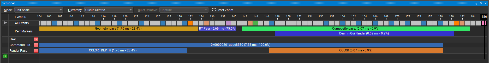
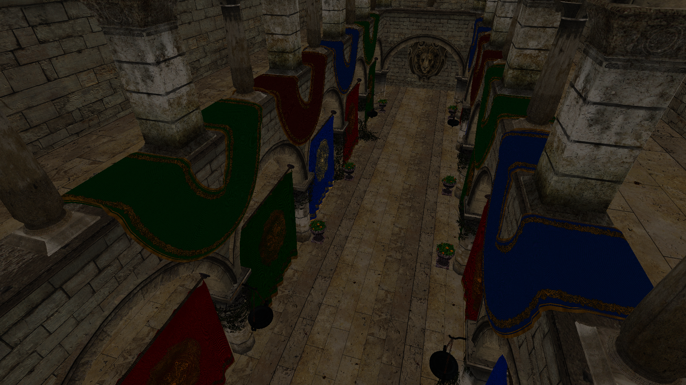
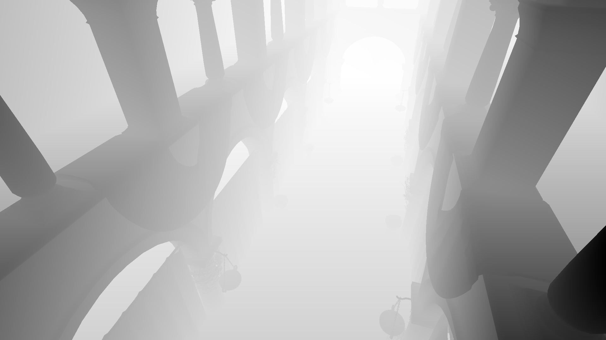
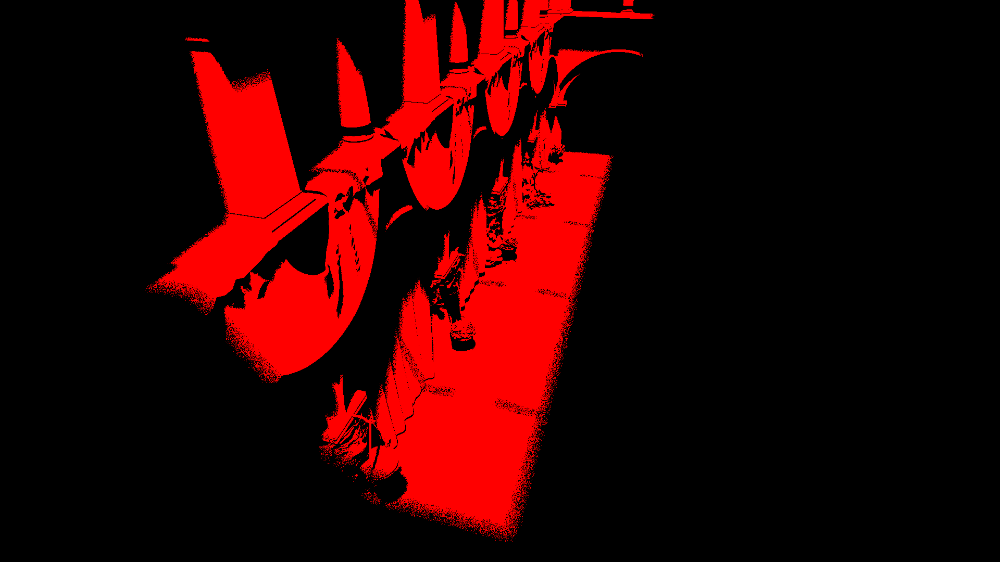
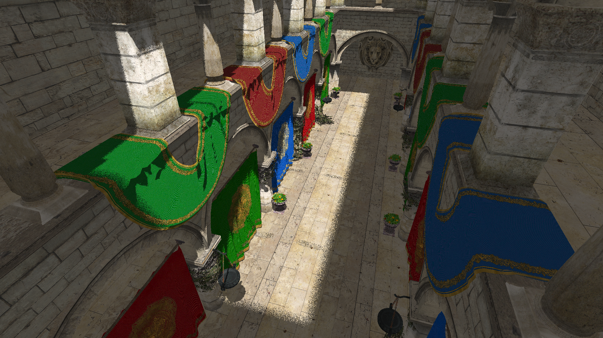
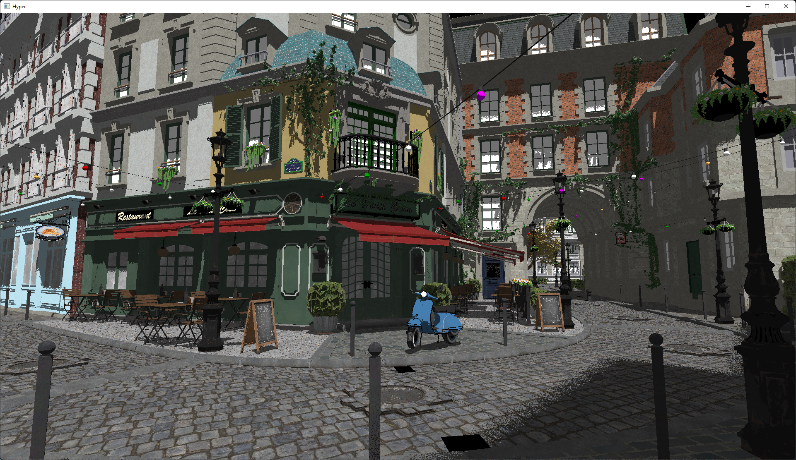
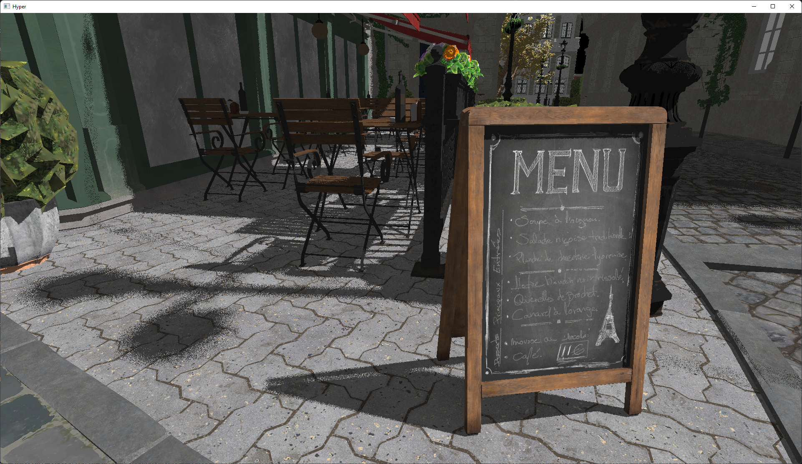
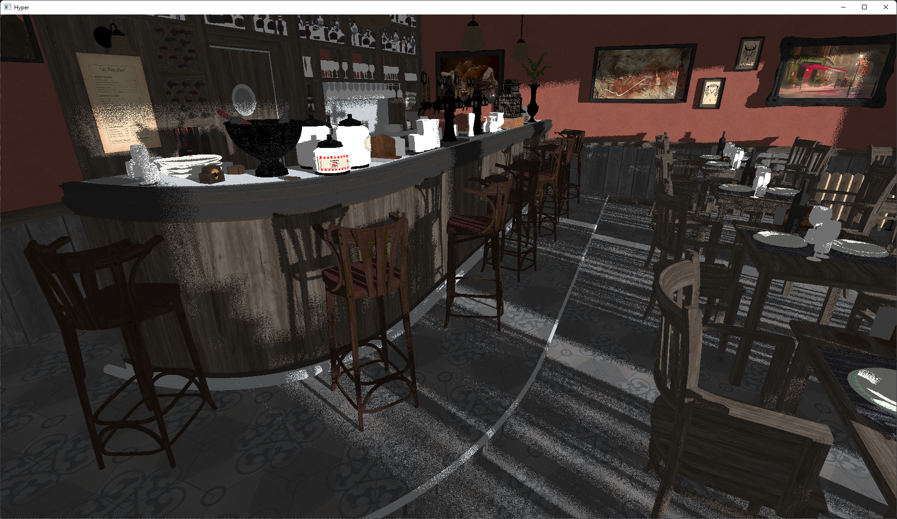

# Hyper

This is my hybrid ray tracer project, which I started to look into how the Vulkan Ray Tracing API works.

Because this is mostly a research project, the code is far from perfect. It is probably decent enough that a beginner might learn a thing or two, but definitely don't look at this for best-practices.

# General info

## Frame structure



The renderer works in three passes:
1. Geometry pass
2. Ray tracing pass
3. Combine pass

### 1. Geometry pass

The geometry pass simply renders the mesh albedo and scene depth to an off-screen render target.

<details>
<summary>Color output</summary>
format: R8G8B8A8_UNORM


</details>

<details>
<summary>Depth output</summary>
format: D24_UNORM_S8_UINT


</details>

### 2. Ray tracing pass

The ray tracing pass traces 1 shadow ray per pixel, to see if that pixel should be shaded as shadow or as lit.

<details>
<summary>Ray tracing output</summary>
format: R8_UNORM


</details>

### 3. Combine pass

The combine pass takes the geometry and ray tracing outputs and combines them together to present the final image.
In here, gamma correction and some simple exposure control is also applied.

After this step, the Dear ImGui ui is drawn on top of this final output.

<details>
<summary>Combine pass output</summary>
format: B8G8R8A8_UNORM (needed to present this final output to the swap chain)


</details>

## Coordinate system

Hyper uses a right-handed z-up coordinate system, the same system that Blender's default settings use.

## Loading your own models

The project out-of-the-box comes with the standard Sponza model.
Luckily enough loading your own models is super easy:

1. Open `Hyper/src/Hyper/Scene/Scene.cpp` file, and scroll down to the `Scene::OnInitialize()` implementation.
2. Change the line which imports the model from a file:

```cpp
ImportModel("path/to/my/model.gltf", /* position */, /* rotation */, /* scale */);
```
The position, rotation and scale parameters are of type `glm::vec3`, and default to `{0, 0, 0}`, `{0, 0, 0}` and `{1, 1, 1}` respectively.

Hyper uses [Assimp](https://github.com/assimp/assimp) to load models, so almost any model format _should_ be supported.


# Getting Started

## Prerequisites

- Vulkan 1.3 SDK
- git LFS
- python
- a GPU that is able to run ray tracing workloads.

## Setting it up

1. Clone the repository recursively to get all the submodules: `git clone --recurse-submodules https://github.com/SeppahBaws/Hyper.git`
2. Double-click the `scripts/SetupMinimal.bat` file to generate the project.

The `scripts/Setup.bat` script features some more options:
- `Use VLD` - this will use Visual Leak Detector to detect memory leaks (limited to Windows and Visual Studio)
- `Use Nsight Aftermath` - this will use the Nsight Aftermath SDK to handle GPU crashes (limited to systems with NVIDIA GPUs)

# Screenshots

_who doesn't like some fancy screenshots, right?_

<details>
<summary>Expand to show screenshots</summary>

| | |
| --- | --- |
|  |  |
|  |  |
|  |  |
|  |  |

</details>
